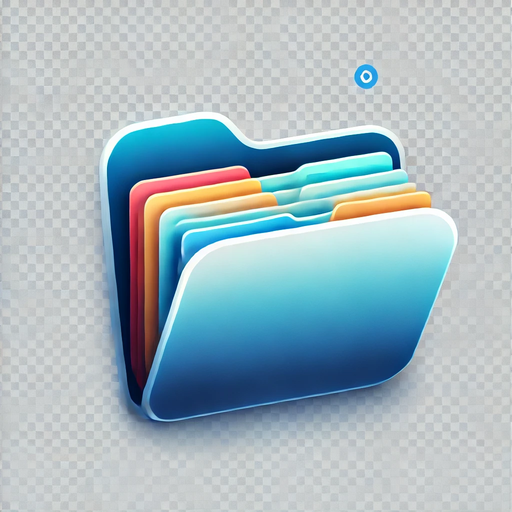

# Klasör Düzenleyici

macOS için geliştirilen bu uygulama, seçtiğiniz klasördeki dosyaları uzantılarına göre otomatik olarak düzenler. Menü çubuğunda çalışan bu uygulama, dağınık klasörlerinizi hızlıca organize etmenize yardımcı olur.

<p align="center">
  
</p>

## Özellikler

- Menü çubuğunda (status bar) yer alan küçük bir simge ile kolay erişim
- Klasör seçimi için kullanıcı dostu arayüz
- Dosyaları uzantılarına göre otomatik olarak alt klasörlere taşıma
- İşlem sırasında ilerleme göstergesi
- İşlem sonucunu bildiren durum mesajları
- Tamamen Türkçe arayüz

## Ekran Görüntüleri

<p align="center">
  
  
</p>

## Gereksinimler

- macOS 11.0 veya daha yeni sürüm

## Kurulum

### DMG ile Kurulum

1. [Releases](https://github.com/yourusername/klasor-duzenleyici/releases) sayfasından en son sürümü indirin.
2. İndirilen `.dmg` dosyasını açın.
3. Uygulamayı Uygulamalar klasörüne sürükleyin.
4. Uygulamalar klasöründen "Klasör Düzenleyici" uygulamasını başlatın.

### Kaynak Koddan Derleme

1. Bu projeyi bilgisayarınıza klonlayın:
   ```bash
   git clone https://github.com/yourusername/klasor-duzenleyici.git
   cd klasor-duzenleyici
   ```

2. Uygulamayı derleyin:
   ```bash
   swift build -c release
   ```

3. DMG dosyası oluşturmak için:
   ```bash
   chmod +x build-dmg.sh
   ./build-dmg.sh
   ```

4. Oluşturulan DMG dosyasını `build/KlasorDuzenleyici.dmg` konumunda bulabilirsiniz.

## Nasıl Kullanılır

1. Uygulamayı başlattığınızda, ekranın üst kısmındaki menü çubuğunda bir klasör simgesi görünecektir.
2. Bu simgeye tıkladığınızda açılan panelden "Seç" düğmesine tıklayarak düzenlemek istediğiniz klasörü seçin.
3. "Dosyaları Düzenle" düğmesine tıklayarak işlemi başlatın.
4. Uygulama, seçtiğiniz klasördeki tüm dosyaları uzantılarına göre alt klasörlere taşıyacaktır.

## Nasıl Çalışır

Uygulama, seçilen klasördeki her dosyanın uzantısını kontrol eder ve aynı uzantıya sahip dosyaları gruplamak için bu uzantı adında alt klasörler oluşturur. Örneğin:

- `.pdf` uzantılı dosyalar için `pdf` klasörü
- `.jpg` uzantılı dosyalar için `jpg` klasörü
- Uzantısı olmayan dosyalar için `Diger` klasörü

## Geliştirme

Xcode'da projeyi açmak için:

```bash
swift package generate-xcodeproj
open KlasorDuzenleyici.xcodeproj
```

## Katkıda Bulunma

1. Bu projeyi fork edin
2. Kendi feature branch'inizi oluşturun (`git checkout -b feature/amazing-feature`)
3. Değişikliklerinizi commit edin (`git commit -m 'Add some amazing feature'`)
4. Branch'inizi push edin (`git push origin feature/amazing-feature`)
5. Pull Request açın

## Lisans

Bu proje MIT Lisansı altında lisanslanmıştır - detaylar için [LICENSE](LICENSE) dosyasına bakın.

## İletişim

Yusuf Efe Taşdelen - [@ysftsdln](https://twitter.com/ysftsdln) - efe@tasdelen.net

Proje Linki: [https://github.com/ysftsdln0/klasor-duzenleyici](https://github.com/ysftsdln0/klasor-duzenleyici) 
